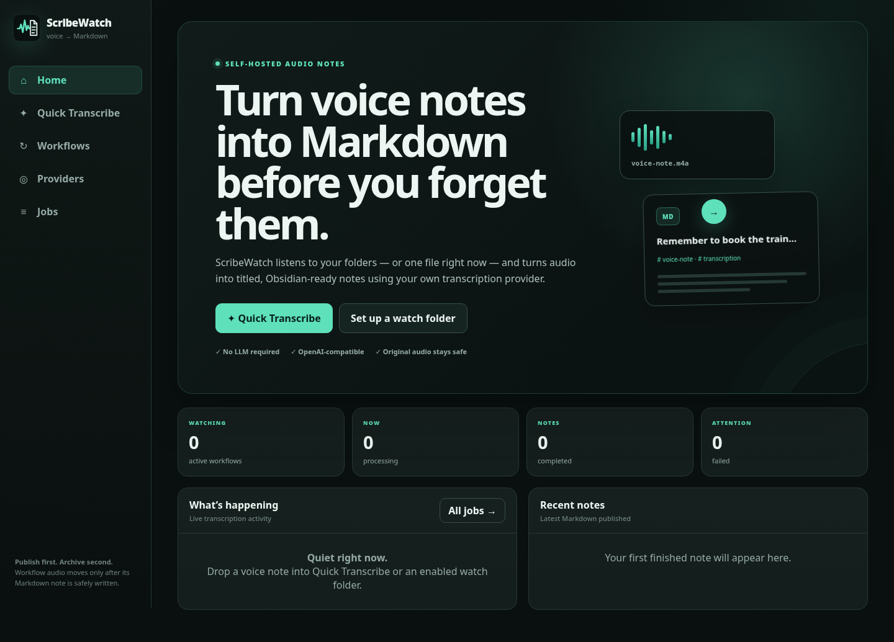
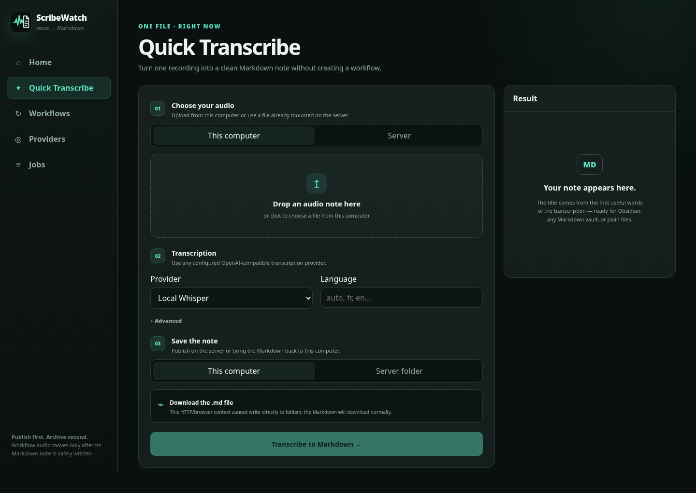
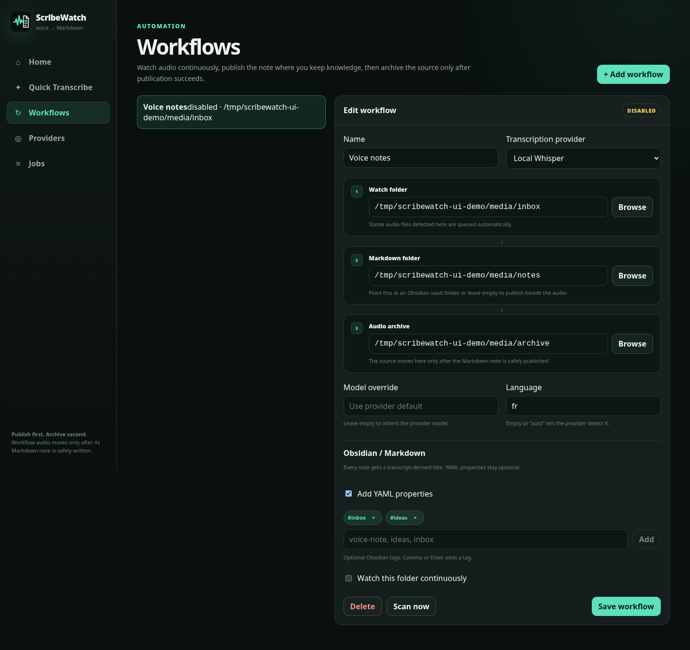
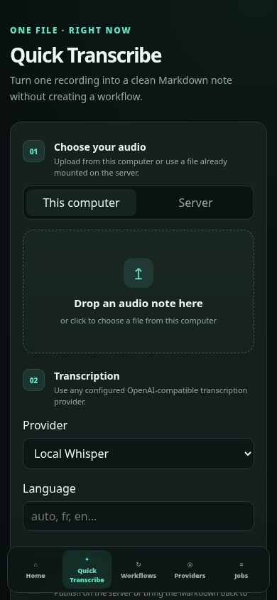

<p align="center">
  
</p>

<h1 align="center">ScribeWatch</h1>

<p align="center">
  <strong>Voice in. Markdown out. Automatically.</strong><br>
  Self-hosted voice-note transcription for Obsidian, Markdown folders and automated audio workflows.
</p>

<p align="center">
  <a href="https://github.com/GodsQuantum/ScribeWatch/actions/workflows/ci.yml"></a>
  <a href="LICENSE"></a>
  
  
  
  
</p>

<p align="center">🇫🇷 <a href="README.fr.md">README en français</a></p>

---

ScribeWatch turns recordings into **clean, titled Markdown notes** using your own OpenAI-compatible speech-to-text provider. Drop one voice memo into **Quick Transcribe**, record directly in **Live Recorder**, or point a **Workflow** at a folder and let ScribeWatch handle new recordings automatically.

The transcript remains canonical and deterministic. When a workflow needs more structure, an optional OpenAI-compatible LLM can add a reusable meeting, consultation, brainstorm or custom structured view **without replacing the original transcript**.

It is especially useful as a **voice notes → Obsidian** bridge, but nothing is Obsidian-specific: any Markdown folder works.

<p align="center">
  
</p>

## ✨ Why ScribeWatch?

- **Voice notes become useful files** — readable `.md`, not another pile of forgotten recordings.
- **Quick Transcribe** — drag in one audio file and get Markdown back immediately.
- **Live Recorder** — record a browser microphone with device selection, timer and live level meter, then transcribe on Stop.
- **Watch folders** — automatically process new recordings from a server, NAS or mounted sync folder.
- **Content-based audio ingest** — FFprobe detects decodable audio streams instead of trusting a filename extension; FFmpeg normalizes every source before STT.
- **Optional AI structure profiles** — reusable meeting, medical-documentation, brainstorm, interview and custom prompts can add a structured view after transcription.
- **Multi-format export** — keep Markdown as the source and export completed notes as MD, TXT, HTML, DOCX, ODT or PDF.
- **Obsidian-friendly by default** — clean filenames, H1 titles, YAML properties and tags.
- **Bring your own transcription engine** — works with OpenAI-compatible STT endpoints such as Speaches/Whisper services.
- **Resilient transcription chains** — mix providers and models in any order. If one route fails, ScribeWatch automatically tries the next — even another model from the same provider.
- **No LLM required** — titles and Markdown formatting are deterministic; the transcript stays authoritative.
- **Readable deterministic paragraphs** — Unicode sentence boundaries (UAX #29) plus fixed size limits make long transcripts readable without paraphrasing, summarizing or inventing headings.
- **Safe publication** — Markdown is written before workflow audio is archived, and existing notes are never silently overwritten.
- **Small self-hosted stack** — Rust/Axum backend, SvelteKit UI, SQLite state, one container.

## 🎙️ Three ways to use it

| | **Quick Transcribe** | **Live Recorder** | **Watch folders** |
|---|---|---|---|
| Best for | One existing recording | Record now from a microphone | Recurring / automatic capture |
| Input | Browser upload or server file | Browser microphone | Watched server/NAS folder |
| Output | Server folder or your computer | Server folder or your computer | Markdown folder |
| Original audio | Never moved | Temporary browser upload is cleaned after processing | Archived only after Markdown succeeds |
| AI structure | Optional | Optional | Optional |
| Typical use | “I just recorded an idea” | Meeting / consultation / brainstorm | Phone/sync folder → Obsidian automatically |

<p align="center">
  
  
</p>

## 🔁 Provider + model fallbacks

Every transcription route is an explicit **provider + model** pair. ScribeWatch discovers the models exposed by each configured provider, so you choose the exact chain — including multiple models from the same provider.

```text
Speaches / whisper-large-v3
          ↓ failed
Speaches / distil-whisper-large-v3
          ↓ failed
OpenAI / gpt-4o-transcribe
          ↓
Markdown
```

There is **no processing timeout by default**, which matters for long recordings. Each route can optionally define its own fallback timeout (`Never`, 10/30/60 minutes or custom). Connection failures, provider errors, rate limits and invalid responses can fall through; explicit user cancellation stops the whole chain. Jobs keep the attempt history and record the provider/model that actually succeeded.

## 🚀 Quick start

Requirements: Docker Engine + Compose and an OpenAI-compatible transcription endpoint.

```bash
git clone https://github.com/GodsQuantum/ScribeWatch.git
cd ScribeWatch
cp .env.example .env
cp compose.example.yaml compose.yaml
mkdir -p config data watch notes archive

docker compose pull
docker compose up -d
```

Open **http://127.0.0.1:3000**, then:

1. Add your transcription endpoint under **STT**.
2. Use **Quick** for an existing recording, **Live** for a browser microphone, or create a **Workflow**.
3. Optional: add an OpenAI-compatible LLM under **AI Profiles** and connect one or more structure profiles.
4. For automation, choose **Watch folder → Markdown folder → Audio archive**.
5. Point the Markdown folder at your Obsidian vault, synced notes folder, NAS, or any other Markdown destination.

> By default ScribeWatch binds locally. If you expose it on a trusted LAN/VPN, change `SCRIBEWATCH_BIND_HOST` and use your normal firewall or authenticated reverse proxy policy.

## 🧠 Built for Obsidian — not locked to it

A transcript can become a note like this:

```markdown
---
title: "Remember to book the train tomorrow"
created: 2026-09-16T08:42:00Z
tags:
  - voice-note
  - transcription
  - scribewatch
source: "Recording 42.m4a"
provider: "Local Speaches"
model: "whisper-large-v3"
language: "en"
---

# Remember to book the train tomorrow

Remember to book the train tomorrow...
```

ScribeWatch derives the title from the transcript, keeps Unicode-readable filenames, deduplicates tags and handles filename collisions as `Title (2).md`, `Title (3).md`, etc.

### Deterministic transcript formatting

By default ScribeWatch formats the transcript body into readable paragraphs **without an LLM**. Unicode sentence boundaries follow **Unicode Standard Annex #29** through Rust's `unicode-segmentation` crate; sentences are grouped with fixed sentence/word/character limits; punctuation-free STT falls back to fixed word-count blocks; and existing blank-line boundaries are preserved. **No word is rewritten, summarized or semantically reclassified.**

Disable **Readable deterministic paragraphs** in Quick Transcribe or a Workflow when you want the provider transcript body exactly as returned.

### Optional AI structure profiles

LLM processing is a **second, optional layer**. ScribeWatch always finishes STT first and keeps that transcript intact. When a structure profile is selected, the resulting note contains both:

```text
Audio → FFmpeg normalization → STT → canonical transcript
                                      ├─ deterministic Markdown
                                      └─ optional structure profile → Structured notes
```

Built-in profiles cover general structured notes, meetings/phone calls, medical-consultation documentation drafts, marketing brainstorms and interviews/research. They can be connected to any OpenAI-compatible chat-completions endpoint and edited for your deployment; custom profiles can be created from scratch.

Long transcripts are processed in bounded evidence chunks before final synthesis. The system prompt treats transcript text as untrusted data, forbids invented facts, and requires uncertainty to remain explicit. If the LLM fails, **the job still succeeds with the canonical transcript** and records the structuring error separately.

<p align="center">
  
</p>

## 🔄 Workflow model

```text
Voice recorder / sync / NAS
            │
            ▼
       Watch folder
            │
       transcription
            │
            ▼
      Markdown folder ─────► Obsidian / notes / knowledge base
            │
     publish succeeds
            │
            ▼
       Audio archive
```

Workflow audio is **never archived before Markdown publication succeeds**. Native filesystem events are backed by periodic reconciliation, which also helps with network-mounted folders where events may be missed.

## 🔒 Safety by design

- Provider API keys stay server-side and are never returned to the browser.
- Server browsing is restricted to explicit allowed roots and rejects symlink escapes.
- Browser uploads are bounded while streaming and cleaned after terminal job states.
- Quick Transcribe never moves or deletes the original source file.
- Existing Markdown is never silently overwritten.
- Interrupted work is recorded explicitly after restart instead of pretending it completed.
- LLM structure is best-effort: it can never replace or invalidate a successful canonical transcript.
- Document export neutralizes Markdown image targets and disables raw HTML before Pandoc conversion.
- The example container runs non-root with a read-only root filesystem, dropped capabilities and `no-new-privileges`.

See [`SECURITY.md`](.github/SECURITY.md).

## ⚙️ Configuration

| Variable | Default | Purpose |
|---|---|---|
| `SCRIBEWATCH_HOST` | `0.0.0.0` | HTTP bind address inside the container |
| `SCRIBEWATCH_PORT` | `3000` | HTTP port |
| `SCRIBEWATCH_CONFIG_DIR` | `/config` | SQLite/config directory |
| `SCRIBEWATCH_DATA_DIR` | `/data` | Quick upload/result staging |
| `SCRIBEWATCH_ALLOWED_ROOTS` | required | Colon-separated server roots ScribeWatch may access |
| `SCRIBEWATCH_SCAN_SECONDS` | `5` | Watch-folder reconciliation cadence |
| `SCRIBEWATCH_FILE_STABILITY_MS` | `2000` | Stable-size/mtime window before ingest |
| `SCRIBEWATCH_MAX_TRANSCRIPTION_JOBS` | `2` | Concurrent transcription jobs |
| `SCRIBEWATCH_MAX_UPLOAD_BYTES` | `2147483648` | Maximum streamed browser upload |
| `SCRIBEWATCH_QUICK_RESULT_RETENTION_HOURS` | `24` | Client-result retention window |

Audio ingest is **content-based, not extension-based**. Stable Watch files and Quick uploads are probed with FFprobe; any file containing an audio stream that the bundled FFmpeg can decode is accepted, then normalized to mono 16 kHz PCM WAV before STT.

## 🧩 Client-computer folders

Browsers cannot continuously watch arbitrary folders on another computer. ScribeWatch keeps that boundary explicit:

- local audio enters through drag-and-drop, the browser file picker, or Live Recorder microphone capture;
- completed Markdown can be written directly to a local folder when the browser supports the File System Access API in a secure context;
- otherwise ScribeWatch downloads the `.md` normally.

No browser directory handle is sent to or stored by the ScribeWatch server.

## 🛠️ Stack & development

**Backend:** Rust 1.98 · Axum · Tokio · SQLite · notify
**Frontend:** Svelte 5 · SvelteKit 2 · TypeScript
**Media / exports:** FFmpeg + FFprobe · Pandoc · WeasyPrint

```bash
cargo fmt --all -- --check
cargo clippy --locked --all-targets --all-features -- -D warnings
cargo test --locked --all-targets
cd frontend && npm ci && npm test && npm run check && npm run build
```

Deterministic end-to-end check:

```bash
bash scripts/e2e-v02.sh
```

## 📡 API highlights

- `POST /api/v1/quick/upload` — streamed browser upload
- `POST /api/v1/quick/server` — allowed server-side audio file
- `GET /api/v1/jobs/{id}/markdown` — completed client-output Markdown
- `GET /api/v1/jobs/{id}/export/{format}` — MD/TXT/HTML/DOCX/ODT/PDF export
- `GET|POST /api/v1/workflows` — watch-folder automation
- `GET|POST /api/v1/providers` — OpenAI-compatible transcription providers
- `GET|POST /api/v1/llm-providers` — optional OpenAI-compatible LLM providers
- `GET|POST /api/v1/structure-profiles` — reusable LLM structure profiles
- `GET /api/v1/jobs`, `GET /api/v1/events` — history and live state
- `GET /api/v1/health`, `GET /api/v1/ready` — health/readiness

## 🤝 Contributing

Issues and pull requests are welcome. See [`CONTRIBUTING.md`](.github/CONTRIBUTING.md) and [`CODE_OF_CONDUCT.md`](.github/CODE_OF_CONDUCT.md).

If ScribeWatch earns a place in your stack, a ⭐ helps other voice-note and Obsidian users find it.

## 📄 License

[MIT](LICENSE)
